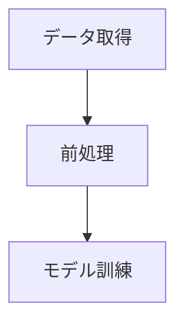

# mermaid-dag-go

mermaidからパースしたDAGオブジェクトを元に、一時的なパイプラインを作って実行するプロジェクトです。

## 概要

Mermaid記法のファイルを読み込み、依存関係を持つタスク（DAG）として解釈・実行することを目指しています。

## プロジェクトリポジトリ

[https://github.com/atomisu0312/mermaid-dag-go](https://github.com/atomisu0312/mermaid-dag-go)

## 利用コンポーネント

- [go-mermaid](https://github.com/sammcj/go-mermaid): Mermaid記法のパースに使用

## 使い方

現状はサンプルの `sample.mmd` を読み込み、DAGの構造を解析して標準出力に表示する機能が実装されています。

### 実行方法

1. リポジトリをクローンします。
2. 依存関係を解決します。
   ```bash
   go mod tidy
   ```
3. プロジェクトルートに `sample.mmd` があることを確認（または作成）し、実行します。
   ```bash
   go run main.go
   ```

### サンプルファイル (sample.mmd)



### 出力例

```
--- Nodes ---
ID: A, Label: "データ取得", Comment: 
ID: B, Label: "前処理", Comment: 
ID: C, Label: "モデル訓練", Comment: 

--- Relations ---
A --> B
B --> C
```

## 今後の展望

- [ ] DAGファイルからパイプラインを動的に作成して実行する機能の実装
