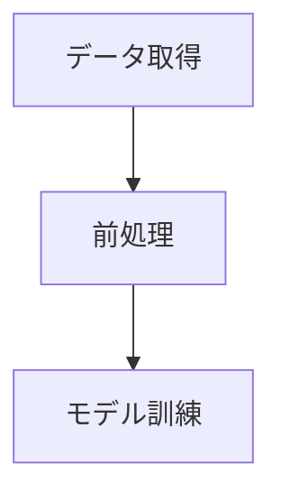

# mermaid-dag-go

mermaidからパースしたDAGオブジェクトを元に、一時的なパイプラインを作って実行するプロジェクトです。

## 概要

Mermaid記法のファイルを読み込み、依存関係を持つタスク（DAG）として解釈・実行することを目指しています。

## プロジェクトリポジトリ

[https://github.com/atomisu0312/mermaid-dag-go](https://github.com/atomisu0312/mermaid-dag-go)

## 利用コンポーネント

- [go-mermaid](https://github.com/sammcj/go-mermaid): Mermaid記法のパースに使用

## 使い方

## 使い方

`sample.mmd` を読み込み、DAGの構造を解析し、定義されたタスクを依存関係順に並列実行します。

### コマンド実行機能
Mermaidファイル内でノード定義の直前に `%% exec <command>` という形式のコメントを記述することで、そのノードに対応するシェルコマンドを実行できます。
コメントがないノードは、ノード名（ラベル）を標準出力に表示します。

### 実行方法

1. リポジトリをクローンします。
2. 依存関係を解決します。
   ```bash
   go mod tidy
   ```
3. 実行するMermaidファイルのパスを指定して実行します。
   ```bash
   go run main.go sample.mmd
   # または
   go run main.go sample/sample1.mmd
   ```

### サンプルファイル (sample.mmd) の記述例



- **コマンド実行**: `%% exec` で始まるコメントを記述すると、そのコマンドが実行されます。
- **引数 ($1)**: コマンド内で `$1` を使用すると、ノードのラベル（例: "データ取得"）が展開されます。
- **デフォルト動作**: `exec` コメントがないノード（例: `C`）は、デフォルトでそのノード名（"モデル訓練"）を標準出力に表示します。
